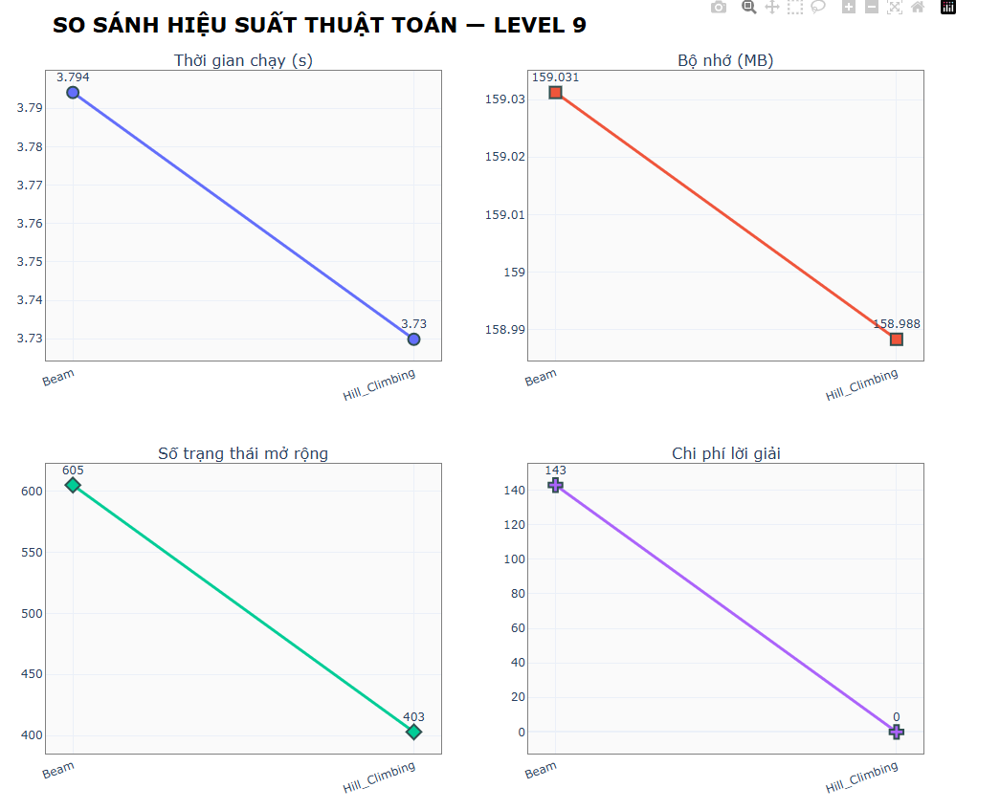
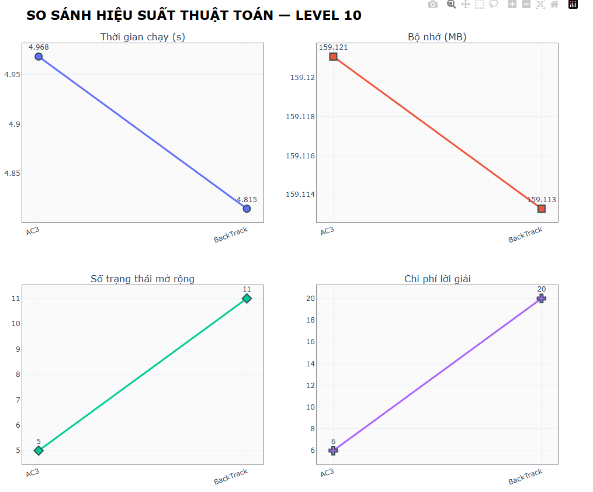

<h1 align="center">Rush Hour Game - Algorithms</h1>

  <h2><b>Đồ Án Nhóm Trí tuệ Nhân Tạo</b> 
  <h2>Giảng viên hướng dẫn: TS. Phan Thị Huyền Trang</h2>

    <b>Nhóm 8:  </b>
    <b>Sinh viên thực hiện:</b> Phan Phúc Hậu — <b>MSSV:</b> 23110097 
    <b>Sinh viên thực hiện:</b> Hà Trường Giang — <b>MSSV:</b> 23110095 

<!-- ====== MỤC LỤC ====== -->
<nav id="toc" style="border:1px solid #e5e7eb;border-radius:10px;padding:16px;margin:16px 0;">
  <h2 style="margin-top:0;">📑 Mục lục</h2>
  <ol style="margin-left:20px;">
    <li><a href="#noi-dung-du-an">Nội dung dự án</a></li>
    <li><a href="#muc-tieu">Mục tiêu</a></li>
    <li><a href="#structure">Cấu trúc thư mục</a></li>
    <li><a href="#demo">Demo Game</a></li>
    <li>
      <a href="#thuat-toan">Thuật toán</a>
      <ol>
        <li>
          <a href="#uninformed-search">Tìm kiếm không thông tin (Uninformed Search)</a>
          <ul>
            <li><a href="#uninformed-thanh-phan">Thành phần chính của bài toán và lời giải</a></li>
            <li><a href="#bfs">Breadth-First Search (BFS)</a></li>
            <li><a href="#dfs">Depth-First Search (DFS)</a></li>
            <li><a href="#uninformed-compare">So sánh các thuật toán Uninformed Search</a></li>
          </ul>
        </li>
        <li>
          <a href="#informed-search">Tìm kiếm có thông tin (Informed Search)</a>
          <ul>
            <li><a href="#informed-thanh-phan">Thành phần chính của bài toán và lời giải</a></li>
            <li><a href="#greedy-best-first">Greedy Best-First Search</a></li>
            <li><a href="#a-star">A* Search</a></li>
            <li><a href="#informed-compare">So sánh các thuật toán Informed Search</a></li>
          </ul>
        </li>
        <li>
          <a href="#local-search">Tìm kiếm cục bộ (Local Search)</a>
          <ul>
            <li><a href="#local-thanh-phan">Thành phần chính của bài toán và lời giải</a></li>
            <li><a href="#simple-hill-climbing">Simple Hill Climbing</a></li>
            <li><a href="#beam-search">Beam Search</a></li>
            <li><a href="#local-compare">So sánh các thuật toán Local Search</a></li>
          </ul>
        </li>
        <li>
          <a href="#complex-env-search">Tìm kiếm trong môi trường phức tạp (Complex Environment Search)</a>
          <ul>
            <li><a href="#complex-thanh-phan">Thành phần chính của bài toán và lời giải</a></li>
            <li><a href="#and-or-search">AND-OR Search Algorithm</a></li>
            <li><a href="#partially-observable-search">Partially Observable Search</a></li>
            <li><a href="#complex-compare">So sánh các thuật toán Complex Environment</a></li>
          </ul>
        </li>
        <li>
          <a href="#csp">Tìm kiếm có điều kiện ràng buộc (Constraint Satisfaction Problem)</a>
          <ul>
            <li><a href="#csp-thanh-phan">Thành phần chính của bài toán và lời giải</a></li>
            <li><a href="#backtracking-csp">Backtracking CSP</a></li>
            <li><a href="#backtracking-ac3">Backtracking AC-3</a></li>
            <li><a href="#csp-compare">So sánh các thuật toán CSP</a></li>
          </ul>
        </li>
      </ol>
    </li>
    <li><a href="#ket-luan">Kết luận</a></li>
  </ol>
</nav>

<!-- ====== SƯỜN NỘI DUNG ====== -->
<h2 id="noi-dung-du-an" style="color: red;">1. Nội dung dự án</h2>

  <b>Rush Hour</b> là bài toán trò chơi trên lưới <b>6×6</b>, trong đó các xe (dài 2 hoặc 3 ô)
  chỉ được di chuyển tịnh tiến theo <i>hướng đặt</i> (ngang hoặc dọc). Giải quyết bài toán kẹt xe hàng ngày
  bằng các thuật toán tìm kiếm khác nhau, từ đó có thể đánh giá hiệu quả của thuật toán trong việc tìm
  ra giải pháp tối ưu hơn.
  Kết quả được đánh giá theo số bước, chi phí, thời gian chạy và mức sử dụng bộ nhớ.

<h2 id="muc-tieu">2. Mục tiêu</h2>

  Xây dựng và đánh giá bộ giải <b>Rush Hour 6×6</b> dựa trên mô hình trạng thái bất biến (immutable) và các thuật toán tìm kiếm, 
  với khả năng đọc bàn cờ từ tệp CSV, sinh nước đi hợp lệ, kiểm tra trạng thái đích và tính heuristic để tối ưu hoá quá trình giải.

<ul>
  <li>
    <b>Chuẩn hoá dữ liệu đầu vào:</b> 
    Đọc ma trận bàn cờ từ <code>.csv</code> (<code>csv_to_matrix</code>, <code>Board.from_csv</code>) và
    chuyển đổi sang cấu trúc <code>Board</code> gồm các <code>Vehicle</code> hợp lệ (<code>Board.from_matrix</code>).
  </li>
  <li>
    <b>Mô hình hoá trạng thái bất biến:</b>
    Sử dụng <code>@dataclass(frozen=True)</code> cho <code>Board</code> để mỗi thao tác sinh ra trạng thái mới 
    (<code>move_vehicle</code>), giúp dễ dàng dùng trong cây/tập tìm kiếm và tránh hiệu ứng phụ.
  </li>
  <li>
    <b>Xác định điều kiện đích rõ ràng:</b>
    Hoàn thành khi đuôi xe đỏ (xe mục tiêu, index 0) chạm cột thoát bên phải 
    (<code>is_final_configuration</code>).
  </li>
  <li>
    <b>Sinh nước đi hợp lệ:</b>
    Tạo toàn bộ bước di chuyển tiến/lùi cho từng xe theo trục của xe, loại trừ va chạm ô đã chiếm 
    (<code>get_moves</code>), kèm chi phí di chuyển theo độ dài xe.
  </li>
  <li>
    <b>Thiết kế heuristic có ý nghĩa:</b> 
    Ước lượng chi phí còn lại bằng tổng số ô xe đỏ cần đi qua và số bước tối thiểu để dọn đường 
    (<code>get_minimum_cost</code>, <code>minimum_steps_required_to_clear_direct_path</code>, 
    <code>vehicles_in_the_way_of_red</code>, <code>get_tiles_to_cover_by_red</code>), hỗ trợ A*/Greedy.
  </li>
    <ul>
      <li>Uninformed: BFS, DFS</li>
      <li>Informed: Greedy Best-First, A*</li>
      <li>Local Search: Hill Climbing, Beam Search.</li>
      <li>Complex Environment: And-Or Search, Partially Observable Search</li>
    </ul>
  <li>
    <b>Đảm bảo khả năng đánh giá và tái lập:</b>
    Cung cấp chuyển đổi hai chiều ma trận &harr; trạng thái (<code>to_matrix</code>), 
    băm trạng thái (<code>__hash__</code>) để chống lặp và phục vụ thống kê, benchmark.
  </li>
</ul>

  <b>Kết quả mong đợi:</b> Tập lời giải tối ưu/ gần tối ưu cho nhiều layout CSV, 
  thống kê số nút mở rộng, thời gian, bộ nhớ, và phân tích tác động của heuristic đến chất lượng/ tốc độ giải.

<h2 id="structure">3. Cấu trúc thư mục</h2>

Dự án được tổ chức theo hướng mô-đun, đảm bảo khả năng mở rộng và tái sử dụng cao. Cấu trúc tổng thể như sau:

<pre>
📦 RushHourAI
├── 📁 Board/                     # Chứa các map-level trò chơi
│    ├── board1.csv
│    ├── board2.csv
│    └── ...
│
├── 📁 images/                    # Lưu trữ hình ảnh giao diện, xe, biểu tượng, nền, v.v.
│    └── ...
│
├── 📁 sounds/                    # Hiệu ứng âm thanh cho trò chơi (click, error,...)
│    └── ...
│
├── 📁 src/                       # Mã nguồn chính của Game
│    ├── 📁 algorithm/            → Xử lý thuật toán tìm kiếm & logic giải bài toán
│    │     ├── result.py
│    │     ├── exception.py
│    │     ├── bfs.py
│    │     ├── dfs.py
│    │     └── ...
│    │
│    ├── 📁 app/                  → Thành phần điều khiển giao diện và hiển thị trò chơi
│    │     ├── assets.py
│    │     ├── control.py
│    │     ├── game.py
│    │     ├── result_overlay.py
│    │     ├── screen.py
│    │     ├── selection_overlay.py
│    │     └── ui.py
│    │
│    ├── 📁 config/               → Cấu hình chung (màu sắc, đường dẫn, kích thước UI,…)
│    │     ├── colors.py
│    │     ├── paths.py
│    │     └── ui.py
│    │
│    ├── 📁 model/                → Lớp mô hình dữ liệu và trạng thái
│    │     ├── board.py           → Biểu diễn ma trận 6×6, trạng thái bàn chơi
│    │     ├── move.py            → Hành động di chuyển
│    │     ├── node.py            → Nút trong cây tìm kiếm (state, parent, cost,…)
│    │     └── vehicle.py         → Mô tả các xe (vị trí, chiều, độ dài,…)
│    │
│    └── ...
│
└── 🧩 Main.py                    → File chính khởi động chương trình (entry point)
</pre>

<h2 id="demo">4. Demo Game:</h2>

<table style="width:100%; border-collapse:separate; border-spacing:16px;">
  <tr>
    <td style="width:50%; vertical-align:top;">
      

        <h3 style="margin:0 0 8px 0;">📌 Choose algorithms and levels</h3>
        
        <!-- Optional: mô tả ngắn -->
        

          Chọn Levels và Algorithms, Pause, Reload, Music
        

      

    </td>
    <td style="width:50%; vertical-align:top;">
      

        <h3 style="margin:0 0 8px 0;">📼 Play animations and reset</h3>
        
        

            Chế độ Manual di chuyển ở người chơi.
        

      

    </td>
  </tr>
</table>

<h2 id="thuat-toan">4. Thuật toán</h2>

<h3 id="uninformed-search">4.1. Tìm kiếm không thông tin (Uninformed Search)</h3>
<h4 id="uninformed-thanh-phan">4.1.1. Thành phần chính của bài toán và lời giải</h4>

<h4>Thành phần chính của bài toán:</h4>
<ul>
  <li><b>Trạng thái:</b> Ma trận 6×6 gồm các xe có hướng (ngang/dọc), độ dài 2–3 ô và vị trí xác định. Xe đỏ (mục tiêu) luôn là xe đầu tiên.</li>
  <li><b>Hành động:</b> Di chuyển một xe tiến hoặc lùi 1 ô theo hướng hợp lệ, không va chạm hoặc vượt ra ngoài lưới.</li>
  <li><b>Kiểm tra mục tiêu:</b> Khi xe đỏ thoát ra khỏi mép phải của bảng.</li>
  <li><b>Hàm chi phí:</b> Mỗi hành động di chuyển có chi phí bằng độ dài xe tương ứng.</li>
  <li><b>Đặc điểm:</b> Không sử dụng heuristic, dựa hoàn toàn vào không gian trạng thái hợp lệ của các cấu hình xe.</li>
</ul>

<h4>Lời giải:</h4>

  Lời giải là chuỗi các bước di chuyển hợp lệ giúp xe đỏ thoát ra khỏi bảng. 
  Các thuật toán tìm kiếm (BFS, DFS) duyệt không gian trạng thái, 
  trả về đường đi, chi phí và số trạng thái đã duyệt. 
  Nếu không tìm thấy lời giải, kết quả là No Found Solution.

<!-- ====== GIANG VIẾT PHẦN NÀY ====== -->
<h4 id="bfs">4.1.2. Breadth-First Search (BFS)</h4>
<h4 id="dfs">4.1.3. Depth-First Search (DFS)</h4>

<b>Mô tả:</b> DFS (Tìm kiếm theo chiều sâu) khám phá sâu nhất một chuỗi di chuyển của các xe trước khi quay lui. 
Thuật toán sử dụng <b>ngăn xếp (stack)</b> để mở rộng trạng thái kế tiếp.

<h4>Phân tích lý thuyết:</h4>
<ul>
  <li><b>Tính tối ưu:</b> Không đảm bảo tìm được đường thoát ngắn nhất cho xe đỏ.</li>
  <li><b>Hoạt động:</b> Đi sâu vào một chuỗi di chuyển của các xe, quay lui khi không thể tiếp tục.</li>
  <li><b>Quản lý vòng lặp:</b> Dùng tập <code>visited</code> để tránh duyệt lại các cấu hình bảng đã gặp.</li>
</ul>

<h4>Ưu điểm:</h4>
<ul>
  <li>Tiết kiệm bộ nhớ hơn so với BFS.</li>
  <li>Nhanh nếu nhánh đầu tiên chứa lời giải gần.</li>
</ul>

<h4>Nhược điểm:</h4>
<ul>
  <li>Không đảm bảo tối ưu, có thể đi sai hướng hoặc lặp vô hạn nếu không kiểm tra trạng thái.</li>
  <li>Có nguy cơ <b>tràn ngăn xếp</b> với độ sâu lớn.</li>
</ul>

<h4>Độ phức tạp:</h4>
<ul>
  <li><b>Thời gian:</b> O(bd) với b là số trạng thái con, d là độ sâu cực đại.</li>
  <li><b>Bộ nhớ:</b> O(d).</li>
</ul>

<h4>Hình ảnh minh họa:</h4>

   
  <i>Mô hình hoạt động của DFS</i>

<h4>Liên kết:</h4>

<a href="https://www.geeksforgeeks.org/dsa/depth-first-search-or-dfs-for-a-graph/" target="_blank">
GeeksForGeeks – Depth-First Search</a>

<h4>Nhận xét:</h4>

DFS phù hợp khi bộ nhớ hạn chế và cần thử nhanh các hướng đi, 
nhưng không hiệu quả nếu yêu cầu đường đi ngắn nhất hoặc khi có nhiều nhánh sâu không cần thiết.

<h4 id="uninformed-compare">4.1.4. So sánh các thuật toán Uninformed Search</h4>

   
  <i>So sánh hiệu suất Uninfomation</i>

<h3 id="informed-search">4.2. Tìm kiếm có thông tin (Informed Search)</h3>
<h4 id="informed-thanh-phan">4.2.1. Thành phần chính của bài toán và lời giải</h4>

<h4>Thành phần chính của bài toán:</h4>
<ul>
  <li><b>Trạng thái:</b> Ma trận 6×6 biểu diễn vị trí và hướng (ngang/dọc) của các xe. Xe đỏ (mục tiêu) luôn là xe đầu tiên cần thoát khỏi bảng.</li>
  <li><b>Hành động:</b> Di chuyển một xe tiến hoặc lùi 1 ô theo hướng hợp lệ, không chồng lên xe khác hoặc ra khỏi biên.</li>
  <li><b>Kiểm tra mục tiêu:</b> Khi xe đỏ thoát khỏi mép phải của bảng (cột cuối cùng).</li>
  <li><b>Hàm heuristic:</b> Ước lượng “độ gần” đến lời giải dựa trên:
    <ul>
      <li><b>H1 – Blocking Cars:</b> số xe đang chắn đường ra của xe đỏ.</li>
      <li><b>H2 – Blocking Distance:</b> số ô còn lại để xe đỏ thoát + bước ước lượng để dọn các xe chắn.</li>
    </ul>
  </li>
  <li><b>Hàm chi phí:</b> Mỗi hành động di chuyển có chi phí bằng độ dài xe tương ứng.</li>
  <li><b>Đặc điểm:</b> Sử dụng hàm heuristic để định hướng mở rộng trạng thái, giúp giảm không gian tìm kiếm.</li>
</ul>

<h4>Lời giải:</h4>

  Lời giải là chuỗi các bước di chuyển tối ưu giúp xe đỏ thoát ra ngoài,
  được đánh giá theo hàm <b>f(n) = g(n) + h(n)</b>.

<ul>
  <li><b>Greedy Best-First:</b> chỉ dựa trên ước lượng <b>h(n)</b>.</li>
  <li><b>A*</b>: kết hợp chi phí thực tế và ước lượng <b>f(n) = g(n) + h(n)</b> để tìm đường đi tối ưu.</li>
</ul>

<h4 id="greedy-best-first">4.2.2. Greedy Best-First Search</h4>

  <b>Mô tả:</b> Greedy Best-First Search (GBFS) chọn trạng thái có giá trị 
  <b>heuristic thấp nhất</b> để mở rộng, nhằm tiếp cận nhanh lời giải. 
  Thuật toán sử dụng <b>hàng đợi ưu tiên (priority queue)</b> sắp xếp theo giá trị <code>h(n)</code>.

<h4>Phân tích lý thuyết:</h4>
<ul>
  <li><b>Tính tối ưu:</b> Không đảm bảo tìm được đường đi ngắn nhất.</li>
  <li><b>Hàm heuristic:</b> Dựa trên số xe chắn đường xe đỏ và khoảng cách còn lại để xe đỏ thoát (<i>Blocking Cars</i> hoặc <i>Blocking Distance</i>).</li>
  <li><b>Hoạt động:</b> Mở rộng trạng thái có <code>h(n)</code> nhỏ nhất trước.</li>
  <li><b>Quản lý vòng lặp:</b> Sử dụng tập <code>visited</code> để tránh mở lại các trạng thái đã duyệt.</li>
</ul>

<h4>Ưu điểm:</h4>
<ul>
  <li>Nhanh hơn so với tìm kiếm không thông tin (Uninformed Search).</li>
  <li>Tiết kiệm thời gian nếu hàm heuristic đủ chính xác.</li>
</ul>

<h4>Nhược điểm:</h4>
<ul>
  <li>Không đảm bảo lời giải tối ưu.</li>
  <li>Kết quả phụ thuộc mạnh vào chất lượng hàm heuristic.</li>
</ul>

<h4>Độ phức tạp:</h4>
<ul>
  <li><b>Thời gian:</b> O(bd).</li>
  <li><b>Bộ nhớ:</b> O(bd).</li>
</ul>

<h4>Hình ảnh minh họa:</h4>

   
  <i>Mô hình hoạt động của Greedy</i>

<h4>Liên kết:</h4>

  <a href="https://www.geeksforgeeks.org/greedy-best-first-search-algorithm/" target="_blank">
    GeeksforGeeks – Greedy Best-First Search
  </a>

<h4>Nhận xét:</h4>

  Greedy Best-First Search hoạt động hiệu quả khi cần tìm lời giải nhanh cho Rush Hour,
  nhưng có thể chọn đường đi không tối ưu nếu heuristic chưa chính xác.

<!-- ====== GIANG VIẾT PHẦN NÀY ====== -->
<h4 id="a-star">4.2.3. A* Search</h4>
<h4 id="informed-compare">4.2.4. So sánh các thuật toán Informed Search</h4>

   
  <i>So sánh hiệu suất Infomation</i>

<h3 id="local-search">4.3. Tìm kiếm cục bộ (Local Search)</h3>
<h4 id="local-thanh-phan">4.3.1. Thành phần chính của bài toán và lời giải</h4>
<ul>
  <li><b>Trạng thái:</b> Ma trận 6×6 biểu diễn vị trí các xe trên bảng. Mỗi xe có hướng (ngang/dọc) và độ dài (2–3 ô). Xe đỏ là xe mục tiêu cần thoát ra ngoài.</li>
  <li><b>Hành động:</b> Di chuyển ngẫu nhiên một xe tiến hoặc lùi 1 ô theo hướng hợp lệ để tạo ra trạng thái lân cận mới.</li>
  <li><b>Kiểm tra mục tiêu:</b> Trạng thái đích đạt được khi xe đỏ thoát ra khỏi mép phải của bảng.</li>
  <li><b>Hàm heuristic:</b> Dựa trên số xe chắn đường và số ô còn lại để xe đỏ thoát (<i>Blocking Cars</i>, <i>Blocking Distance</i>).</li>
  <li><b>Hàm chi phí:</b> Mỗi hành động di chuyển có chi phí bằng độ dài xe tương ứng.</li>
  <li><b>Đặc điểm:</b>
    <ul>
      <li><b>Simple Hill Climbing:</b> Chọn trạng thái lân cận đầu tiên có giá trị heuristic thấp hơn hiện tại.</li>
      <li><b>Beam Search:</b> Giữ lại một số lượng cố định (<i>beam_width</i>) trạng thái tốt nhất ở mỗi bước, thay vì mở rộng toàn bộ.</li>
    </ul>
  </li>
</ul>

<h4>Lời giải:</h4>

  Lời giải là chuỗi các trạng thái hợp lệ, mỗi trạng thái có giá trị heuristic được cải thiện so với trạng thái trước, 
  dần dẫn đến cấu hình mà xe đỏ có thể thoát ra khỏi bảng.

<!-- ====== GIANG VIẾT PHẦN NÀY ====== -->
<h4 id="simple-hill-climbing">4.3.2. Simple Hill Climbing</h4>
<h4 id="beam-search">4.3.3. Beam Search</h4>

<b>Mô tả:</b> Beam Search giới hạn số trạng thái được giữ lại mỗi bước bằng tham số <b>k</b> (beam width). 
Tại mỗi tầng, chỉ chọn <b>k</b> trạng thái có giá trị heuristic thấp nhất (số xe chắn và khoảng cách xe đỏ cần di chuyển) để mở rộng tiếp.

<h4>Phân tích lý thuyết:</h4>
<ul>
  <li><b>Tính tối ưu:</b> Không đảm bảo, có thể bỏ lỡ đường đi tốt nhất.</li>
  <li><b>Hoạt động:</b> Mở rộng và giữ lại <b>k</b> trạng thái con tốt nhất theo giá trị <code>h(n)</code>.</li>
  <li><b>Quản lý vòng lặp:</b> Dùng giới hạn <b>k</b> và tập <code>visited</code> để tránh mở rộng vô hạn.</li>
</ul>

<h4>Ưu điểm:</h4>
<ul>
  <li>Tiết kiệm bộ nhớ, tốc độ nhanh nếu <b>k</b> nhỏ.</li>
  <li>Có thể điều chỉnh linh hoạt <b>k</b> để cân bằng giữa tốc độ và độ chính xác.</li>
</ul>

<h4>Nhược điểm:</h4>
<ul>
  <li>Không đảm bảo tối ưu, phụ thuộc vào <b>k</b> và heuristic.</li>
</ul>

<h4>Độ phức tạp:</h4>
<ul>
  <li><b>Thời gian:</b> O(k · b · d), với <b>b</b> là hệ số phân nhánh, <b>d</b> là độ sâu.</li>
  <li><b>Bộ nhớ:</b> O(k).</li>
</ul>

<h4>Hình ảnh minh họa:</h4>

   
  <i>Mô hình hoạt động của Beam</i>

<h4>Liên kết:</h4>

<a href="https://www.geeksforgeeks.org/beam-search/" target="_blank">GeeksforGeeks – Beam Search</a>

<h4>Nhận xét:</h4>

Beam Search phù hợp khi cần cân bằng giữa tốc độ và chất lượng lời giải, nhưng không đảm bảo tối ưu trong Rush Hour.

<h4 id="local-compare">4.3.4. So sánh các thuật toán Local Search</h4>

   
  <i>So sánh hiệu suất Local Search</i>

<h3 id="complex-env-search">4.4. Tìm kiếm trong môi trường phức tạp (Complex Environment Search)</h3>
<h3 id="complex-search">4.4.1. Thành phần chính của bài toán và lời giải</h3>

<h4>Thành phần chính của bài toán:</h4>
<ul>
  <li><b>Trạng thái:</b> Ma trận 6×6 biểu diễn vị trí các xe. 
    Với môi trường phức tạp (Partial/No Observation), trạng thái được mở rộng thành 
    <i>tập hợp các belief states</i> – phân phối xác suất về vị trí xe.</li>
  <li><b>Hành động:</b> Di chuyển một xe tiến hoặc lùi 1 ô theo hướng hợp lệ để tạo ra trạng thái mới hoặc cập nhật tập belief.</li>
  <li><b>Kiểm tra mục tiêu:</b> Khi xe đỏ thoát khỏi bảng. 
    Với môi trường không quan sát, mục tiêu là tập belief có xác suất cao nhất chứa trạng thái thắng.</li>
  <li><b>Đặc điểm:</b> Môi trường không xác định hoặc quan sát hạn chế, cần xử lý đồng thời nhiều khả năng trạng thái.</li>
  <li><b>Phân loại:</b> 
    <ul>
      <li><b>AND-OR Search:</b> Đầu vào là một trạng thái xác định.</li>
      <li><b>Partial Observation Search:</b> Đầu vào là tập hợp các trạng thái khả dĩ.</li>
    </ul>
  </li>
</ul>

<h4>Lời giải:</h4>

  Lời giải là chuỗi hành động giúp chuyển từ tập trạng thái ban đầu 
  đến tập hợp chứa trạng thái mà xe đỏ có thể thoát ra khỏi bảng.

<h4 id="and-or-search">4.4.2. AND-OR Search Algorithm</h4>
<h4 id="partially-observable-search">4.4.3. Partially Observable Search</h4>

<b>Mô tả:</b> Giải Rush Hour 6×6 khi chỉ quan sát được một phần trạng thái (hoặc không chắc chắn vị trí một số xe).
Thuật toán duy trì <i>belief state</i> (tập các cấu hình Board khả dĩ) và chọn hành động an toàn cho mọi cấu hình trong belief.

<h4>Phân tích lý thuyết:</h4>
<ul>
  <li><b>Tính tối ưu:</b> Không đảm bảo do thiếu thông tin.</li>
  <li><b>Hoạt động:</b> Cập nhật belief sau mỗi hành động/quan sát; chỉ áp dụng các nước đi là giao cắt hợp lệ trên <b>mọi</b> Board trong belief (conformant).</li>
  <li><b>Quản lý vòng lặp:</b> Lưu tập belief đã duyệt để tránh lặp.</li>
</ul>

<h4>Ưu điểm:</h4>
<ul>
  <li>Phù hợp môi trường không xác định/quan sát hạn chế.</li>
  <li>Mô phỏng các tình huống thực tế hơn (thiếu dữ liệu đầu vào).</li>
</ul>

<h4>Nhược điểm:</h4>
<ul>
  <li>Duy trì belief phức tạp, tốn tài nguyên.</li>
  <li>Ít cần thiết với Rush Hour chuẩn (trạng thái thường xác định).</li>
</ul>

<h4>Độ phức tạp (ước lượng):</h4>
<ul>
  <li><b>Thời gian:</b> O(bd · |B|) với <b>b</b> hệ số phân nhánh, <b>d</b> độ sâu, <b>|B|</b> số cấu hình trong belief.</li>
  <li><b>Bộ nhớ:</b> O(|B|).</li>
</ul>

<h4>Hình ảnh minh họa:</h4>

   
  <i>Mô hình hoạt động của partially-observable-search</i>

<h4>Liên kết:</h4>

<a href="https://en.wikipedia.org/wiki/Partially_observable_Markov_decision_process" target="_blank">
Wikipedia – Partially Observable Markov Decision Process</a>

<h4>Nhận xét:</h4>

Hữu ích khi đầu vào không đầy đủ; với code minh họa, có thể dùng BFS trên không gian belief, đích đạt khi <b>mọi</b> Board trong belief là trạng thái thắng.

<h3 id="csp">4.5. Tìm kiếm có điều kiện ràng buộc (Constraint Satisfaction Problem)</h3>
<h3 id="csp-components">4.5.1. Thành phần chính của bài toán và lời giải</h3>

<h4>Thành phần chính của bài toán (Rush Hour 6×6 dưới dạng CSP):</h4>
<ul>
  <li><b>Trạng thái (State):</b> Tập biến <code>X_i</code> cho mỗi xe <code>v_i</code> (xe đỏ là <code>X_0</code>). 
      Mỗi biến mô tả vị trí “đầu xe” (ô trái nhất với xe ngang, ô trên cùng với xe dọc).</li>
  <li><b>Miền giá trị (Domains):</b> 
    <ul>
      <li>Xe ngang độ dài <code>L</code> trên hàng cố định <code>r</code>: cột <code>c ∈ [0, 6−L]</code>.</li>
      <li>Xe dọc độ dài <code>L</code> trên cột cố định <code>c</code>: hàng <code>r ∈ [0, 6−L]</code>.</li>
    </ul>
  </li>
  <li><b>Ràng buộc (Constraints):</b>
    <ul>
      <li><b>Trong biên:</b> Mọi ô của mỗi xe nằm trong lưới 6×6.</li>
      <li><b>Không chồng lấp:</b> Tập ô chiếm bởi các xe là rời nhau (disjoint).</li>
      <li><b>Hướng cố định:</b> Mỗi xe giữ nguyên hướng (ngang/dọc) và độ dài (2–3 ô).</li>
      <li><b>Ràng buộc mục tiêu:</b> Xe đỏ <code>X_0</code> có ô cuối cùng ở cột phải nhất (<code>col = 5</code>), tức sẵn sàng thoát.</li>
    </ul>
  </li>
</ul>

<h4>Lời giải:</h4>

  Một gán trị cho các biến <code>X_i</code> thoả tất cả ràng buộc (không chồng lấp, trong biên, hướng cố định) 
  và thoả <b>ràng buộc mục tiêu</b> của xe đỏ. 
  Khi giải bằng tìm kiếm trên CSP: chuỗi bước là các thay đổi vị trí hợp lệ dẫn từ trạng thái ban đầu đến gán trị thoả mục tiêu.

<h4 id="backtracking-csp">4.5.2. Backtracking CSP</h4>

<b>Mô tả:</b> Áp dụng tìm kiếm quay lui để gán vị trí cho các xe trong Rush Hour 6×6, 
đảm bảo thỏa mãn các ràng buộc như không chồng lấp, nằm trong biên và giữ đúng hướng xe.

<h4>Phân tích lý thuyết:</h4>
<ul>
  <li><b>Tính tối ưu:</b> Không đảm bảo đường đi ngắn nhất, nhưng đảm bảo trạng thái hợp lệ.</li>
  <li><b>Hoạt động:</b> Gán vị trí cho từng xe, nếu vi phạm ràng buộc thì quay lui, 
      tiếp tục cho đến khi xe đỏ đạt vị trí thoát khỏi bảng.</li>
  <li><b>Quản lý vòng lặp:</b> Quay lui tự động loại bỏ các cấu hình không hợp lệ.</li>
</ul>

<h4>Ưu điểm:</h4>
<ul>
  <li>Hiệu quả trong việc kiểm tra tính hợp lệ của trạng thái.</li>
  <li>Có thể kết hợp heuristic để rút ngắn quá trình tìm kiếm.</li>
</ul>

<h4>Nhược điểm:</h4>
<ul>
  <li>Chậm nếu không gian trạng thái lớn.</li>
  <li>Không tối ưu về số bước di chuyển.</li>
</ul>

<h4>Độ phức tạp:</h4>
<ul>
  <li><b>Thời gian:</b> O(bd), với <b>b</b> là số vị trí khả dĩ, <b>d</b> là số xe.</li>
  <li><b>Bộ nhớ:</b> O(d) cho ngăn xếp quay lui.</li>
</ul>

<h4>Hình ảnh minh họa:</h4>

   
  <i>Mô hình hoạt động của Backtracking</i>

<h4>Liên kết:</h4>

<a href="https://www.geeksforgeeks.org/backtracking-introduction/" target="_blank">GeeksforGeeks – Backtracking CSP</a>

<h4>Nhận xét:</h4>

Backtracking CSP phù hợp để kiểm tra các cấu hình hợp lệ trong Rush Hour,
nhưng không hiệu quả khi cần tìm lời giải tối ưu hoặc thời gian thực.

<h4 id="backtracking-ac3">4.5.3. Backtracking AC-3</h4>

<h4 id="csp-compare">4.5.4. So sánh các thuật toán Local Search</h4>

   
  <i>So sánh hiệu suất CSP</i>

<h2 id="ket-luan">5. Kết luận</h2>
    

    Dự án <b>Rush Hour AI</b> đã xây dựng thành công một hệ thống giải trò chơi <b>Rush Hour 6×6</b> 
    bằng nhiều thuật toán trí tuệ nhân tạo cho phép người chơi có nhiều góc nhìn đa diện về cách sắp xếp
    xử lý một bài toán hiệu quả.
     
    Game có nhiều tính năng cho người chơi có thể chọn nhiều Level và từng Level sẽ có những cách giải
    quyết bài toán tùy vào thuật toán trí tuệ nhân tạo. Giao diện trực quan người chơi có thể tự thao
    tác theo ý muốn.
     
    Kết quả thực nghiệm cho thấy mỗi thuật toán đều có đặc trưng riêng: 
    thuật toán tìm kiếm không thông tin đảm bảo tìm được lời giải nhưng tiêu tốn tài nguyên; 
    các thuật toán heuristic như A* giúp rút ngắn thời gian tìm kiếm; 
    trong khi Beam Search và CSP mang lại hiệu quả khi giới hạn trạng thái hoặc có ràng buộc cụ thể.
    

