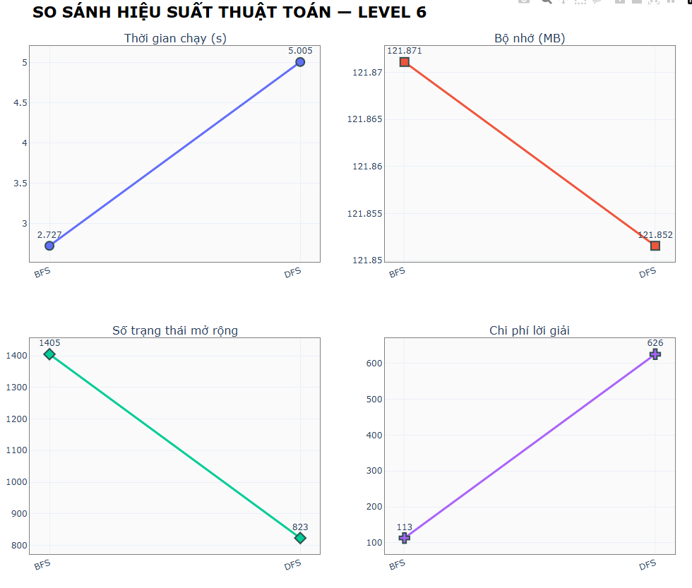
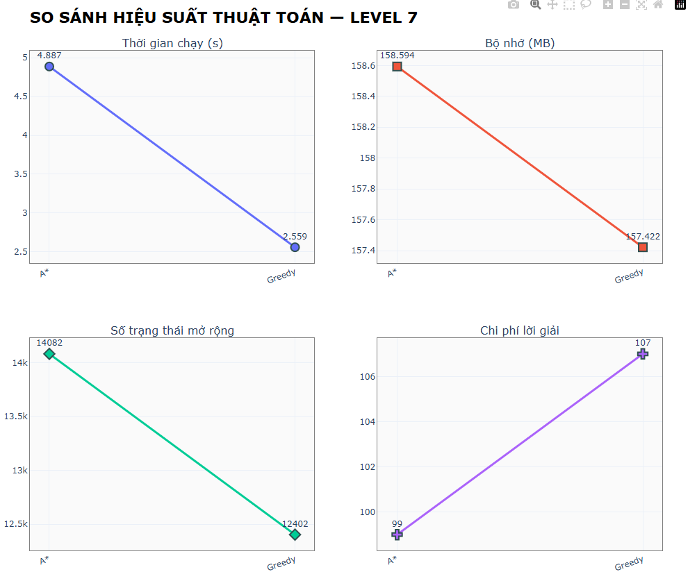

<h1 align="center">Rush Hour Game - Algorithms</h1>

  <h2><b>Äồ AÌn NhoÌm Trí tuệ Nhân Tạo</b> 
  <h2>Giảng viên hướng dẫn: TS. Phan Thị Huyền Trang</h2>

    <b>NhoÌm 8:  </b>
    <b>Sinh viên thực hiện:</b> Phan PhuÌc Hậu — <b>MSSV:</b> 23110097 
    <b>Sinh viên thực hiện:</b> Hà Trường Giang — <b>MSSV:</b> 23110095 

<!-- ====== MỤC LỤC ====== -->
<nav id="toc" style="border:1px solid #e5e7eb;border-radius:10px;padding:16px;margin:16px 0;">
  <h2 style="margin-top:0;">📑 Mục lục</h2>
  <ol style="margin-left:20px;">
    <li><a href="#noi-dung-du-an">Nội dung dự án</a></li>
    <li><a href="#muc-tieu">Mục tiêu</a></li>
    <li><a href="#structure">Cấu trúc thư mục</a></li>
    <li><a href="#demo">Demo Game</a></li>
    <li>
      <a href="#thuat-toan">Thuật toán</a>
      <ol>
        <li>
          <a href="#uninformed-search">Tìm kiếm không thông tin (Uninformed Search)</a>
          <ul>
            <li><a href="#uninformed-thanh-phan">Thành phần chính của bài toán và lời giải</a></li>
            <li><a href="#bfs">Breadth-First Search (BFS)</a></li>
            <li><a href="#dfs">Depth-First Search (DFS)</a></li>
            <li><a href="#uninformed-compare">So sánh các thuật toán Uninformed Search</a></li>
          </ul>
        </li>
        <li>
          <a href="#informed-search">Tìm kiếm có thông tin (Informed Search)</a>
          <ul>
            <li><a href="#informed-thanh-phan">Thành phần chính của bài toán và lời giải</a></li>
            <li><a href="#greedy-best-first">Greedy Best-First Search</a></li>
            <li><a href="#a-star">A* Search</a></li>
            <li><a href="#informed-compare">So sánh các thuật toán Informed Search</a></li>
          </ul>
        </li>
        <li>
          <a href="#local-search">Tìm kiếm cục bộ (Local Search)</a>
          <ul>
            <li><a href="#local-thanh-phan">Thành phần chính của bài toán và lời giải</a></li>
            <li><a href="#simple-hill-climbing">Simple Hill Climbing</a></li>
            <li><a href="#beam-search">Beam Search</a></li>
            <li><a href="#local-compare">So sánh các thuật toán Local Search</a></li>
          </ul>
        </li>
        <li>
          <a href="#complex-env-search">Tìm kiếm trong môi trường phức tạp (Complex Environment Search)</a>
          <ul>
            <li><a href="#complex-thanh-phan">Thành phần chính của bài toán và lời giải</a></li>
            <li><a href="#and-or-search">AND-OR Search Algorithm</a></li>
            <li><a href="#partially-observable-search">Partially Observable Search</a></li>
            <li><a href="#complex-compare">So sánh các thuật toán Complex Environment</a></li>
          </ul>
        </li>
        <li>
          <a href="#csp">Tìm kiếm có điều kiện ràng buộc (Constraint Satisfaction Problem)</a>
          <ul>
            <li><a href="#csp-thanh-phan">Thành phần chính của bài toán và lời giải</a></li>
            <li><a href="#backtracking-csp">Backtracking CSP</a></li>
            <li><a href="#backtracking-ac3">Backtracking AC-3</a></li>
            <li><a href="#csp-compare">So sánh các thuật toán CSP</a></li>
          </ul>
        </li>
      </ol>
    </li>
    <li><a href="#ket-luan">Kết luận</a></li>
  </ol>
</nav>

<!-- ====== SƯỜN NỘI DUNG ====== -->
<h2 id="noi-dung-du-an" style="color: red;">1. Nội dung dự án</h2>

  <b>Rush Hour</b> là bài toán trò chơi trên lưới <b>6×6</b>, trong đó các xe (dài 2 hoặc 3 ô)
  chỉ được di chuyển tịnh tiến theo <i>hướng đặt</i> (ngang hoặc dọc). Giải quyết bài toán kẹt xe hàng ngày
  bằng các thuật toán tìm kiếm khác nhau, từ đó có thể đánh giá hiệu quả của thuật toán trong việc tìm
  ra giải pháp tối ưu hơn.
  Kết quả được đánh giá theo số bước, chi phí, thời gian chạy và mức sử dụng bộ nhớ.

<h2 id="muc-tieu">2. Mục tiêu</h2>

  Xây dựng và đánh giá bộ giải <b>Rush Hour 6×6</b> dựa trên mô hình trạng thái bất biến (immutable) và các thuật toán tìm kiếm, 
  với khả năng đọc bàn cờ từ tệp CSV, sinh nước đi hợp lệ, kiểm tra trạng thái đích và tính heuristic để tối ưu hoá quá trình giải.

<ul>
  <li>
    <b>Chuẩn hoá dữ liệu đầu vào:</b> 
    Đọc ma trận bàn cờ từ <code>.csv</code> (<code>csv_to_matrix</code>, <code>Board.from_csv</code>) và
    chuyển đổi sang cấu trúc <code>Board</code> gồm các <code>Vehicle</code> hợp lệ (<code>Board.from_matrix</code>).
  </li>
  <li>
    <b>Mô hình hoá trạng thái bất biến:</b>
    Sử dụng <code>@dataclass(frozen=True)</code> cho <code>Board</code> để mỗi thao tác sinh ra trạng thái mới 
    (<code>move_vehicle</code>), giúp dễ dàng dùng trong cây/tập tìm kiếm và tránh hiệu ứng phụ.
  </li>
  <li>
    <b>Xác định điều kiện đích rõ ràng:</b>
    Hoàn thành khi đuôi xe đỏ (xe mục tiêu, index 0) chạm cột thoát bên phải 
    (<code>is_final_configuration</code>).
  </li>
  <li>
    <b>Sinh nước đi hợp lệ:</b>
    Tạo toàn bộ bước di chuyển tiến/lùi cho từng xe theo trục của xe, loại trừ va chạm ô đã chiếm 
    (<code>get_moves</code>), kèm chi phí di chuyển theo độ dài xe.
  </li>
  <li>
    <b>Thiết kế heuristic có ý nghĩa:</b> 
    Ước lượng chi phí còn lại bằng tổng số ô xe đỏ cần đi qua và số bước tối thiểu để dọn đường 
    (<code>get_minimum_cost</code>, <code>minimum_steps_required_to_clear_direct_path</code>, 
    <code>vehicles_in_the_way_of_red</code>, <code>get_tiles_to_cover_by_red</code>), hỗ trợ A*/Greedy.
  </li>
    <ul>
      <li>Uninformed: BFS, DFS</li>
      <li>Informed: Greedy Best-First, A*</li>
      <li>Local Search: Hill Climbing, Beam Search.</li>
      <li>Complex Environment: And-Or Search, Partially Observable Search</li>
    </ul>
  <li>
    <b>Đảm bảo khả năng đánh giá và tái lập:</b>
    Cung cấp chuyển đổi hai chiều ma trận &harr; trạng thái (<code>to_matrix</code>), 
    băm trạng thái (<code>__hash__</code>) để chống lặp và phục vụ thống kê, benchmark.
  </li>
</ul>

  <b>Kết quả mong đợi:</b> Tập lời giải tối ưu/ gần tối ưu cho nhiều layout CSV, 
  thống kê số nút mở rộng, thời gian, bộ nhớ, và phân tích tác động của heuristic đến chất lượng/ tốc độ giải.

<h2 id="structure">3. Cấu trúc thư mục</h2>

Dự án được tổ chức theo hướng mô-đun, đảm bảo khả năng mở rộng và tái sử dụng cao. Cấu trúc tổng thể như sau:

<pre>
📦 RushHourAI
├── 📁 Board/                     # Chứa các map-level trò chơi
│    ├── board1.csv
│    ├── board2.csv
│    └── ...
│
├── 📁 images/                    # Lưu trữ hình ảnh giao diện, xe, biểu tượng, nền, v.v.
│    └── ...
│
├── 📁 sounds/                    # Hiệu ứng âm thanh cho trò chơi (click, error,...)
│    └── ...
│
├── 📁 src/                       # Mã nguồn chính của Game
│    ├── 📁 algorithm/            → Xử lý thuật toán tìm kiếm & logic giải bài toán
│    │     ├── result.py
│    │     ├── exception.py
│    │     ├── bfs.py
│    │     ├── dfs.py
│    │     └── ...
│    │
│    ├── 📁 app/                  → Thành phần điều khiển giao diện và hiển thị trò chơi
│    │     ├── assets.py
│    │     ├── control.py
│    │     ├── game.py
│    │     ├── result_overlay.py
│    │     ├── screen.py
│    │     ├── selection_overlay.py
│    │     └── ui.py
│    │
│    ├── 📁 config/               → Cấu hình chung (màu sắc, đường dẫn, kích thước UI,…)
│    │     ├── colors.py
│    │     ├── paths.py
│    │     └── ui.py
│    │
│    ├── 📁 model/                → Lớp mô hình dữ liệu và trạng thái
│    │     ├── board.py           → Biểu diễn ma trận 6×6, trạng thái bàn chơi
│    │     ├── move.py            → Hành động di chuyển
│    │     ├── node.py            → Nút trong cây tìm kiếm (state, parent, cost,…)
│    │     └── vehicle.py         → Mô tả các xe (vị trí, chiều, độ dài,…)
│    │
│    └── ...
│
└── 🧩 Main.py                    → File chính khởi động chương trình (entry point)
</pre>

<h2 id="demo">4. Demo Game:</h2>

<table style="width:100%; border-collapse:separate; border-spacing:16px;">
  <tr>
    <td style="width:50%; vertical-align:top;">
      

        <h3 style="margin:0 0 8px 0;">📌 Choose algorithms and levels</h3>
        
        <!-- Optional: mô tả ngắn -->
        

          Chọn Levels và Algorithms, Pause, Reload, Music
        

      

    </td>
    <td style="width:50%; vertical-align:top;">
      

        <h3 style="margin:0 0 8px 0;">📼 Play animations and reset</h3>
        
        

            Chế độ Manual di chuyển ở người chơi.
        

      

    </td>
  </tr>
</table>

<h2 id="thuat-toan">4. Thuật toán</h2>

<h3 id="uninformed-search">4.1. Tìm kiếm không thông tin (Uninformed Search)</h3>
<h4 id="uninformed-thanh-phan">4.1.1. Thành phần chính của bài toán và lời giải</h4>

<h4>Thành phần chính của bài toán:</h4>
<ul>
  <li><b>Trạng thái:</b> Ma trận 6×6 gồm các xe có hướng (ngang/dọc), độ dài 2–3 ô và vị trí xác định. Xe đỏ (mục tiêu) luôn là xe đầu tiên.</li>
  <li><b>Hành động:</b> Di chuyển một xe tiến hoặc lùi 1 ô theo hướng hợp lệ, không va chạm hoặc vượt ra ngoài lưới.</li>
  <li><b>Kiểm tra mục tiêu:</b> Khi xe đỏ thoát ra khỏi mép phải của bảng.</li>
  <li><b>Hàm chi phí:</b> Mỗi hành động di chuyển có chi phí bằng độ dài xe tương ứng.</li>
  <li><b>Đặc điểm:</b> Không sử dụng heuristic, dựa hoàn toàn vào không gian trạng thái hợp lệ của các cấu hình xe.</li>
</ul>

<h4>Lời giải:</h4>

  Lời giải là chuỗi các bước di chuyển hợp lệ giúp xe đỏ thoát ra khỏi bảng. 
  Các thuật toán tìm kiếm (BFS, DFS) duyệt không gian trạng thái, 
  trả về đường đi, chi phí và số trạng thái đã duyệt. 
  Nếu không tìm thấy lời giải, kết quả là No Found Solution.

<!-- ====== GIANG VIẾT PHẦN NÀY ====== -->
<h4 id="bfs">4.1.2. Breadth-First Search (BFS)</h4>

<b>Mô tả:</b> 
Thuật toán <b>BFS (Tìm kiếm theo chiều rộng)</b> trong game <b>Rush Hour 6×6</b> duyệt các trạng thái theo tầng, 
mở rộng tất cả các cấu hình xe ở cùng độ sâu trước khi chuyển sang tầng tiếp theo. 
BFS sử dụng <b>hàng đợi (Queue – FIFO)</b> để quản lý các trạng thái cần mở rộng.

<h4>Phân tích lý thuyết:</h4>
<ul>
  <li><b>Tính tối ưu:</b> Đảm bảo tìm được đường đi ngắn nhất nếu chi phí di chuyển giữa các trạng thái bằng nhau.</li>
  <li><b>Hoạt động:</b> Lần lượt lấy trạng thái đầu hàng đợi, sinh các trạng thái mới từ các nước đi hợp lệ của xe, 
      và đưa chúng vào cuối hàng đợi.</li>
  <li><b>Quản lý vòng lặp:</b> Sử dụng tập <code>explored</code> để tránh duyệt lại các cấu hình xe đã xét.</li>
</ul>

<h4>Ưu điểm:</h4>
<ul>
  <li>Đảm bảo tìm được lời giải tối ưu (ít bước di chuyển nhất).</li>
  <li>Dễ cài đặt, dễ quan sát và trực quan hóa trong game.</li>
</ul>

<h4>Nhược điểm:</h4>
<ul>
  <li>Tiêu tốn nhiều bộ nhớ do lưu toàn bộ trạng thái của mỗi tầng.</li>
  <li>Không hiệu quả với bản đồ có nhiều xe và không gian trạng thái lớn.</li>
</ul>

<h4>Độ phức tạp:</h4>
<ul>
  <li><b>Thá»i gian:</b> O(bd)</li>
  <li><b>Bộ nhớ:</b> O(bd)</li>
</ul>

<h4>Hình ảnh minh họa:</h4>

   
  <i>Mô hình hoạt động của BFS</i>

<h4>Liên kết:</h4>

<a href="https://en.wikipedia.org/wiki/Breadth-first_search" target="_blank">
Wikipedia – Breadth-First Search</a>

<h4>Nhận xét:</h4>

BFS phù hợp cho việc tìm nghiệm ngắn nhất trong các bản đồ Rush Hour nhỏ, 
nhưng dễ bị giới hạn bởi bộ nhớ khi số lượng xe tăng cao.

<h4 id="dfs">4.1.3. Depth-First Search (DFS)</h4>

<b>Mô tả:</b> DFS (Tìm kiếm theo chiá»u sâu) khám phá sâu nhất một chuỗi di chuyển của các xe trước khi quay lui. 
Thuật toán sử dụng <b>ngăn xếp (stack)</b> để mở rộng trạng thái kế tiếp.

<h4>Phân tích lý thuyết:</h4>
<ul>
  <li><b>Tính tối ưu:</b> Không đảm bảo tìm được đường thoát ngắn nhất cho xe đỏ.</li>
  <li><b>Hoạt động:</b> Đi sâu vào một chuỗi di chuyển của các xe, quay lui khi không thể tiếp tục.</li>
  <li><b>Quản lý vòng lặp:</b> Dùng tập <code>visited</code> để tránh duyệt lại các cấu hình bảng đã gặp.</li>
</ul>

<h4>Ưu điểm:</h4>
<ul>
  <li>Tiết kiệm bộ nhớ hơn so với BFS.</li>
  <li>Nhanh nếu nhánh đầu tiên chứa lời giải gần.</li>
</ul>

<h4>Nhược điểm:</h4>
<ul>
  <li>Không đảm bảo tối ưu, có thể đi sai hướng hoặc lặp vô hạn nếu không kiểm tra trạng thái.</li>
  <li>Có nguy cơ <b>tràn ngăn xếp</b> với độ sâu lớn.</li>
</ul>

<h4>Độ phức tạp:</h4>
<ul>
  <li><b>Thá»i gian:</b> O(bd) với b là số trạng thái con, d là độ sâu cực đại.</li>
  <li><b>Bộ nhớ:</b> O(d).</li>
</ul>

<h4>Hình ảnh minh họa:</h4>

   
  <i>Mô hình hoạt động của DFS</i>

<h4>Liên kết:</h4>

<a href="https://www.geeksforgeeks.org/dsa/depth-first-search-or-dfs-for-a-graph/" target="_blank">
GeeksForGeeks – Depth-First Search</a>

<h4>Nhận xét:</h4>

DFS phù hợp khi bộ nhớ hạn chế và cần thử nhanh các hướng đi, 
nhưng không hiệu quả nếu yêu cầu đường đi ngắn nhất hoặc khi có nhiều nhánh sâu không cần thiết.

<h4 id="uninformed-compare">4.1.4. So sánh các thuật toán Uninformed Search</h4>

   
  <i>So sánh hiệu suất Uninfomation</i>

<h3 id="informed-search">4.2. Tìm kiếm có thông tin (Informed Search)</h3>
<h4 id="informed-thanh-phan">4.2.1. Thành phần chính của bài toán và lời giải</h4>

<h4>Thành phần chính của bài toán:</h4>
<ul>
  <li><b>Trạng thái:</b> Ma trận 6×6 biểu diễn vị trí và hướng (ngang/dọc) của các xe. Xe đỏ (mục tiêu) luôn là xe đầu tiên cần thoát khỏi bảng.</li>
  <li><b>Hành động:</b> Di chuyển một xe tiến hoặc lùi 1 ô theo hướng hợp lệ, không chồng lên xe khác hoặc ra khỏi biên.</li>
  <li><b>Kiểm tra mục tiêu:</b> Khi xe đỏ thoát khỏi mép phải của bảng (cột cuối cùng).</li>
  <li><b>Hàm heuristic:</b> Ước lượng “độ gần” đến lời giải dựa trên:
    <ul>
      <li><b>H1 – Blocking Cars:</b> số xe đang chắn đường ra của xe đỏ.</li>
      <li><b>H2 – Blocking Distance:</b> số ô còn lại để xe đỏ thoát + bước ước lượng để dọn các xe chắn.</li>
    </ul>
  </li>
  <li><b>Hàm chi phí:</b> Mỗi hành động di chuyển có chi phí bằng độ dài xe tương ứng.</li>
  <li><b>Đặc điểm:</b> Sử dụng hàm heuristic để định hướng mở rộng trạng thái, giúp giảm không gian tìm kiếm.</li>
</ul>

<h4>Lời giải:</h4>

  Lời giải là chuỗi các bước di chuyển tối ưu giúp xe đỏ thoát ra ngoài,
  được đánh giá theo hàm <b>f(n) = g(n) + h(n)</b>.

<ul>
  <li><b>Greedy Best-First:</b> chỉ dựa trên ước lượng <b>h(n)</b>.</li>
  <li><b>A*</b>: kết hợp chi phí thực tế và ước lượng <b>f(n) = g(n) + h(n)</b> để tìm đường đi tối ưu.</li>
</ul>

<h4 id="greedy-best-first">4.2.2. Greedy Best-First Search</h4>

  <b>Mô tả:</b> Greedy Best-First Search (GBFS) chọn trạng thái có giá trị 
  <b>heuristic thấp nhất</b> để mở rộng, nhằm tiếp cận nhanh lời giải. 
  Thuật toán sử dụng <b>hàng đợi ưu tiên (priority queue)</b> sắp xếp theo giá trị <code>h(n)</code>.

<h4>Phân tích lý thuyết:</h4>
<ul>
  <li><b>Tính tối ưu:</b> Không đảm bảo tìm được đường đi ngắn nhất.</li>
  <li><b>Hàm heuristic:</b> Dựa trên số xe chắn đường xe đỏ và khoảng cách còn lại để xe đỏ thoát (<i>Blocking Cars</i> hoặc <i>Blocking Distance</i>).</li>
  <li><b>Hoạt động:</b> Mở rộng trạng thái có <code>h(n)</code> nhỏ nhất trước.</li>
  <li><b>Quản lý vòng lặp:</b> Sử dụng tập <code>visited</code> để tránh mở lại các trạng thái đã duyệt.</li>
</ul>

<h4>Ưu điểm:</h4>
<ul>
  <li>Nhanh hơn so với tìm kiếm không thông tin (Uninformed Search).</li>
  <li>Tiết kiệm thời gian nếu hàm heuristic đủ chính xác.</li>
</ul>

<h4>Nhược điểm:</h4>
<ul>
  <li>Không đảm bảo lời giải tối ưu.</li>
  <li>Kết quả phụ thuộc mạnh vào chất lượng hàm heuristic.</li>
</ul>

<h4>Độ phức tạp:</h4>
<ul>
  <li><b>Thá»i gian:</b> O(bd).</li>
  <li><b>Bộ nhớ:</b> O(bd).</li>
</ul>

<h4>Hình ảnh minh họa:</h4>

   
  <i>Mô hình hoạt động của Greedy</i>

<h4>Liên kết:</h4>

  <a href="https://www.geeksforgeeks.org/greedy-best-first-search-algorithm/" target="_blank">
    GeeksforGeeks – Greedy Best-First Search
  </a>

<h4>Nhận xét:</h4>

  Greedy Best-First Search hoạt động hiệu quả khi cần tìm lời giải nhanh cho Rush Hour,
  nhưng có thể chọn đường đi không tối ưu nếu heuristic chưa chính xác.

<!-- ====== GIANG VIẾT PHẦN NÀY ====== -->
<h4 id="a-star">4.2.3. A* Search</h4>

<b>Mô tả:</b> 
Thuật toán <b>A*</b> là phương pháp tìm kiếm có thông tin kết hợp giữa chi phí thực tế và chi phí ước lượng. 
Trong trò chơi <b>Rush Hour 6x6</b>, A* sử dụng tổng chi phí:
<code>f(n) = g(n) + h(n)</code>,
trong đó:
<ul>
  <li><b>g(n)</b> là tổng chi phí di chuyển thực tế từ trạng thái ban đầu đến trạng thái hiện tại (tính bằng tổng số bước và độ dài xe di chuyển).</li>
  <li><b>h(n)</b> là giá trị heuristic ước lượng chi phí tối thiểu cần để đưa xe đỏ thoát khỏi bảng.</li>
</ul>

<h4>Phân tích hàm heuristic:</h4>

Hàm <b>heuristic</b> trong Rush Hour được thiết kế dựa trên <b>khoảng cách còn lại</b> và <b>số xe cản đường</b> của xe đỏ:

<ul>
  <li><b>Bước 1:</b> Xác định hàng của xe đỏ và các ô từ đuôi xe đến cửa thoát ở mép phải bảng (gọi là <code>tiles_to_cover</code>).</li>
  <li><b>Bước 2:</b> Đếm số lượng xe khác đang chắn trên đường ra — mỗi xe chắn đều làm tăng chi phí ước lượng.</li>
  <li><b>Bước 3:</b> Với mỗi xe chắn, tính số bước tối thiểu cần di chuyển để giải phóng đường (tùy thuộc vào hướng và độ dài xe).</li>
  <li><b>Bước 4:</b> Tổng chi phí heuristic <code>h(n)</code> được xác định bằng:
    <pre><code>h(n) = số ô còn lại + số bước tối thiểu để giải phóng đường</code></pre>
  </li>
</ul>

Heuristic này luôn <b>đơn điệu (admissible)</b>, nghĩa là nó không bao giờ đánh giá thấp chi phí thật sự. 
Do đó, thuật toán A* đảm bảo tìm được đường đi tối ưu cho Rush Hour.

<h4>Phân tích lý thuyết:</h4>
<ul>
  <li><b>Tính tối ưu:</b> Đảm bảo tìm được đường đi ngắn nhất (nếu heuristic hợp lệ).</li>
  <li><b>Hoạt động:</b> Chọn trạng thái có giá trị <code>f(n)</code> thấp nhất trong hàng đợi ưu tiên (min-heap).</li>
  <li><b>Quản lý vòng lặp:</b> Dùng từ điển <code>visited</code> để lưu trạng thái đã thăm cùng giá trị <code>f(n)</code> tốt nhất.</li>
</ul>

<h4>Ưu điểm:</h4>
<ul>
  <li>Tìm được lời giải tối ưu nhanh hơn nhiều so với BFS/UCS.</li>
  <li>Heuristic hiệu quả giúp giảm số trạng thái duyệt đáng kể.</li>
</ul>

<h4>Nhược điểm:</h4>
<ul>
  <li>Tốc độ phụ thuộc mạnh vào chất lượng của hàm heuristic.</li>
  <li>Cần nhiều bộ nhớ để lưu trữ danh sách mở (open list).</li>
</ul>

<h4>Độ phức tạp:</h4>
<ul>
  <li><b>Thá»i gian:</b> O(bd) (trong trường hợp xấu nhất).</li>
  <li><b>Bộ nhớ:</b> O(bd), do lưu cả trạng thái mở và đã thăm.</li>
</ul>

<h4>Hình ảnh minh họa:</h4>

   
  <i>Mô hình hoạt động của A Star</i>

<h4>Liên kết:</h4>

<a href="https://en.wikipedia.org/wiki/A*_search_algorithm" target="_blank">
Wikipedia – A* Search Algorithm</a>

<h4>Nhận xét:</h4>

A* là một trong những thuật toán mạnh nhất cho trò chơi Rush Hour. 
Khi kết hợp với heuristic dựa trên khoảng cách và xe chắn, 
nó cho kết quả nhanh, ổn định và đảm bảo lời giải tối ưu cho các bản đồ có độ phức tạp trung bình.

<h4 id="informed-compare">4.2.4. So sánh các thuật toán Informed Search</h4>

   
  <i>So sánh hiệu suất Infomation</i>

<h3 id="local-search">4.3. Tìm kiếm cục bộ (Local Search)</h3>
<h4 id="local-thanh-phan">4.3.1. Thành phần chính của bài toán và lời giải</h4>
<ul>
  <li><b>Trạng thái:</b> Ma trận 6×6 biểu diễn vị trí các xe trên bảng. Mỗi xe có hướng (ngang/dọc) và độ dài (2–3 ô). Xe đỏ là xe mục tiêu cần thoát ra ngoài.</li>
  <li><b>Hành động:</b> Di chuyển ngẫu nhiên một xe tiến hoặc lùi 1 ô theo hướng hợp lệ để tạo ra trạng thái lân cận mới.</li>
  <li><b>Kiểm tra mục tiêu:</b> Trạng thái đích đạt được khi xe đỏ thoát ra khỏi mép phải của bảng.</li>
  <li><b>Hàm heuristic:</b> Dựa trên số xe chắn đường và số ô còn lại để xe đỏ thoát (<i>Blocking Cars</i>, <i>Blocking Distance</i>).</li>
  <li><b>Hàm chi phí:</b> Mỗi hành động di chuyển có chi phí bằng độ dài xe tương ứng.</li>
  <li><b>Đặc điểm:</b>
    <ul>
      <li><b>Simple Hill Climbing:</b> Chọn trạng thái lân cận đầu tiên có giá trị heuristic thấp hơn hiện tại.</li>
      <li><b>Beam Search:</b> Giữ lại một số lượng cố định (<i>beam_width</i>) trạng thái tốt nhất ở mỗi bước, thay vì mở rộng toàn bộ.</li>
    </ul>
  </li>
</ul>

<h4>Lời giải:</h4>

  Lời giải là chuỗi các trạng thái hợp lệ, mỗi trạng thái có giá trị heuristic được cải thiện so với trạng thái trước, 
  dần dẫn đến cấu hình mà xe đỏ có thể thoát ra khỏi bảng.

<!-- ====== GIANG VIẾT PHẦN NÀY ====== -->
<h4 id="simple-hill-climbing">4.3.2. Simple Hill Climbing</h4>

<b>Mô tả:</b> 
Thuật toán <b>Hill Climbing</b> trong trò chơi <b>Rush Hour 6×6</b> tìm kiếm lời giải bằng cách 
liên tục di chuyển sang trạng thái lân cận có giá trị heuristic tốt hơn (nhỏ hơn). 
Mỗi lần chỉ giữ một trạng thái tốt nhất hiện tại, không quay lại các trạng thái trước. 
Khi bị kẹt tại cực trị cục bộ, thuật toán có thể dùng các chiến lược mở rộng như 
<b>sideways move</b> hoặc <b>random restart</b> để thoát khá»i bế tắc.

<h4>Phân tích hàm heuristic:</h4>

Hàm heuristic trong Hill Climbing của Rush Hour sử dụng cùng logic với A*:

<ul>
  <li><b>Khoảng cách còn lại</b> từ xe đỏ đến cửa thoát (số ô cần di chuyển).</li>
  <li><b>Số xe chắn đường</b> trước xe đỏ, mỗi xe chắn đóng góp chi phí bổ sung.</li>
  <li><b>Số bước di chuyển tối thiểu</b> để giải phóng đường cho xe đỏ.</li>
</ul>

Tổng giá trị heuristic được tính bằng:
<pre><code>h(n) = số ô còn lại + số bước tối thiểu để dọn xe chắn</code></pre>
Giá trị <code>h(n)</code> càng nhỏ thì trạng thái càng gần mục tiêu.

<h4>Phân tích lý thuyết:</h4>
<ul>
  <li><b>Tính tối ưu:</b> Không đảm bảo tìm được lời giải tối ưu — có thể dừng tại cực trị cục bộ.</li>
  <li><b>Hoạt động:</b> Chọn nước đi có <code>h(n)</code> thấp hơn trạng thái hiện tại, 
      nếu không có nước đi tốt hơn thì dừng lại hoặc khởi động lại ngẫu nhiên.</li>
  <li><b>Quản lý vòng lặp:</b> Duy trì tập trạng thái đã thăm để tránh quay lại, 
      cho phép một số <i>sideways moves</i> để thoát bẫy phẳng.</li>
</ul>

<h4>Chiến lược mở rộng:</h4>
<ul>
  <li><b>Sideways move:</b> Cho phép di chuyển sang trạng thái có cùng heuristic (tối đa 100 lần).</li>
  <li><b>Random restart:</b> Khi bị kẹt, chọn ngẫu nhiên một trạng thái khác để tiếp tục tìm kiếm.</li>
  <li><b>Simulated annealing style:</b> Có xác suất nhỏ (≈30%) chấp nhận trạng thái tệ hơn, 
      giúp thoát khỏi cực trị cục bộ.</li>
  <li><b>Best-first fallback:</b> Khi thất bại, thử tìm lời giải bằng Best-First Search từ trạng thái tốt nhất đã gặp.</li>
</ul>

<h4>Ưu điểm:</h4>
<ul>
  <li>Đơn giản, trực quan, dễ quan sát trong môi trường trực quan hóa.</li>
  <li>Có thể nhanh chóng đạt được trạng thái gần lời giải khi heuristic tốt.</li>
  <li>Hiệu quả với các map nhỏ và ít xe cản.</li>
</ul>

<h4>Nhược điểm:</h4>
<ul>
  <li>Dễ mắc kẹt tại cực trị cục bộ hoặc bẫy phẳng.</li>
  <li>Không đảm bảo tìm được đường đi tối ưu.</li>
  <li>Phụ thuộc mạnh vào chất lượng heuristic và số lần restart.</li>
</ul>

<h4>Độ phức tạp:</h4>
<ul>
  <li><b>Thời gian:</b> O(k × n), với <i>k</i> là số lần restart và <i>n</i> là số trạng thái duyệt.</li>
  <li><b>Bộ nhớ:</b> O(n), chỉ lưu một đường đi duy nhất tại mỗi thời điểm.</li>
</ul>

<h4>Hình ảnh minh họa:</h4>

   
  <i>Mô hình hoạt động của Hill Climbing</i>

<h4>Liên kết:</h4>

<a href="https://en.wikipedia.org/wiki/Hill_climbing" target="_blank">
Wikipedia – Hill Climbing Algorithm</a>

<h4>Nhận xét:</h4>

Hill Climbing phù hợp với trò chơi Rush Hour ở quy mô nhỏ, 
đặc biệt khi cần tốc độ và trực quan, tuy nhiên không đảm bảo lời giải tối ưu 
và có thể cần kết hợp với random restart để tăng khả năng tìm nghiệm.

<h4 id="beam-search">4.3.3. Beam Search</h4>

<b>Mô tả:</b> Beam Search giới hạn số trạng thái được giữ lại mỗi bước bằng tham số <b>k</b> (beam width). 
Tại mỗi tầng, chỉ chá»n <b>k</b> trạng thái có giá trị heuristic thấp nhất (số xe chắn và khoảng cách xe Ä‘á» cần di chuyển) để mở rộng tiếp.

<h4>Phân tích lý thuyết:</h4>
<ul>
  <li><b>Tính tối ưu:</b> Không đảm bảo, có thể bỏ lỡ đường đi tốt nhất.</li>
  <li><b>Hoạt động:</b> Mở rộng và giữ lại <b>k</b> trạng thái con tốt nhất theo giá trị <code>h(n)</code>.</li>
  <li><b>Quản lý vòng lặp:</b> Dùng giới hạn <b>k</b> và tập <code>visited</code> để tránh mở rộng vô hạn.</li>
</ul>

<h4>Ưu điểm:</h4>
<ul>
  <li>Tiết kiệm bộ nhớ, tốc độ nhanh nếu <b>k</b> nhỏ.</li>
  <li>Có thể điều chỉnh linh hoạt <b>k</b> để cân bằng giữa tốc độ và độ chính xác.</li>
</ul>

<h4>Nhược điểm:</h4>
<ul>
  <li>Không đảm bảo tối ưu, phụ thuộc vào <b>k</b> và heuristic.</li>
</ul>

<h4>Độ phức tạp:</h4>
<ul>
  <li><b>Thời gian:</b> O(k · b · d), với <b>b</b> là hệ số phân nhánh, <b>d</b> là độ sâu.</li>
  <li><b>Bộ nhớ:</b> O(k).</li>
</ul>

<h4>Hình ảnh minh họa:</h4>

   
  <i>Mô hình hoạt động của Beam</i>

<h4>Liên kết:</h4>

<a href="https://www.geeksforgeeks.org/beam-search/" target="_blank">GeeksforGeeks – Beam Search</a>

<h4>Nhận xét:</h4>

Beam Search phù hợp khi cần cân bằng giữa tốc độ và chất lượng lá»i giải, nhưng không đảm bảo tối ưu trong Rush Hour.

<h4 id="local-compare">4.3.4. So sánh các thuật toán Local Search</h4>

   
  <i>So sánh hiệu suất Local Search</i>

<h3 id="complex-env-search">4.4. Tìm kiếm trong môi trường phức tạp (Complex Environment Search)</h3>
<h3 id="complex-search">4.4.1. Thành phần chính của bài toán và lời giải</h3>

<h4>Thành phần chính của bài toán:</h4>
<ul>
  <li><b>Trạng thái:</b> Ma trận 6×6 biểu diễn vị trí các xe. 
    Với môi trường phức tạp (Partial/No Observation), trạng thái được mở rộng thành 
    <i>tập hợp các belief states</i> – phân phối xác suất về vị trí xe.</li>
  <li><b>Hành động:</b> Di chuyển một xe tiến hoặc lùi 1 ô theo hướng hợp lệ để tạo ra trạng thái mới hoặc cập nhật tập belief.</li>
  <li><b>Kiểm tra mục tiêu:</b> Khi xe đỏ thoát khỏi bảng. 
    Với môi trường không quan sát, mục tiêu là tập belief có xác suất cao nhất chứa trạng thái thắng.</li>
  <li><b>Đặc điểm:</b> Môi trường không xác định hoặc quan sát hạn chế, cần xử lý đồng thời nhiều khả năng trạng thái.</li>
  <li><b>Phân loại:</b> 
    <ul>
      <li><b>AND-OR Search:</b> Đầu vào là một trạng thái xác định.</li>
      <li><b>Partial Observation Search:</b> Đầu vào là tập hợp các trạng thái khả dĩ.</li>
    </ul>
  </li>
</ul>

<h4>Lời giải:</h4>

  Lời giải là chuỗi hành động giúp chuyển từ tập trạng thái ban đầu 
  đến tập hợp chứa trạng thái mà xe đỏ có thể thoát ra khỏi bảng.

<h4 id="and-or-search">4.4.2. AND–OR Search Algorithm</h4>

<b>Mô tả:</b> 
Thuật toán <b>AND–OR Search</b> được sử dụng trong các bài toán có 
<b>nhiều khả năng kết quả</b> cho mỗi hành động (non-deterministic search). 
Khác với tìm kiếm thông thường chỉ cần một chuỗi hành động (plan), 
AND–OR Search tìm một <b>chiến lược (strategy)</b> đảm bảo đạt mục tiêu 
bất kể trạng thái trung gian nào xảy ra.

Trong trò chơi <b>Rush Hour</b>, mỗi hành động (di chuyển xe) 
luôn tạo ra đúng một trạng thái kế tiếp → cây tìm kiếm chỉ còn các nút OR, 
do đó có thể rút gá»n thành một dạng đơn giản của AND–OR Search.

<h4>Phân tích lý thuyết:</h4>
<ul>
  <li><b>Cấu trúc tìm kiếm:</b>
    <ul>
      <li><b>OR-node:</b> Đại diện cho việc chọn một hành động (ví dụ: di chuyển xe 0, 1, 2,...).</li>
      <li><b>AND-node:</b> Đại diện cho việc kiểm tra tất cả các kết quả có thể của hành động đó. 
      Trong Rush Hour, mỗi hành động chỉ tạo ra một trạng thái, nên AND-node trở nên đơn giản.</li>
    </ul>
  </li>
  <li><b>Tính chất:</b> Tìm kiếm theo chiều sâu đệ quy, kết hợp việc đánh dấu trạng thái đã duyệt 
  để tránh lặp vô hạn trong cây AND–OR.</li>
  <li><b>Điều kiện dừng:</b> Khi trạng thái hiện tại là đích (xe đỏ thoát ra ngoài bảng).</li>
</ul>

<h4>Chiến lược hoạt động:</h4>
<ol>
  <li>Bắt đầu từ trạng thái ban đầu <code>S0</code>.</li>
  <li>Nếu <code>S0</code> là đích → trả về thành công.</li>
  <li>Ngược lại, mở rộng tất cả hành động có thể (các OR-node).</li>
  <li>Với mỗi hành động, sinh ra các trạng thái con (các AND-node) và đệ quy tìm lời giải.</li>
  <li>Nếu tồn tại một hành động dẫn đến lời giải → cây tìm kiếm trả về thành công.</li>
</ol>

<h4>Ưu điểm:</h4>
<ul>
  <li>Có thể áp dụng cho môi trường không xác định, nơi một hành động có nhiều kết quả khác nhau.</li>
  <li>Giúp hình thành chiến lược tổng quát thay vì chỉ một đường đi cụ thể.</li>
  <li>Cấu trúc linh hoạt, dễ mở rộng cho các bài toán quan sát một phần (partially observable).</li>
</ul>

<h4>Nhược điểm:</h4>
<ul>
  <li>Hiệu suất thấp nếu không có heuristic hỗ trợ.</li>
  <li>Trong môi trường xác định như Rush Hour, việc sử dụng AND–OR Search trở nên dư thừa.</li>
  <li>Cần cơ chế quản lý vòng lặp để tránh đệ quy vô hạn.</li>
</ul>

<h4>Độ phức tạp:</h4>
<ul>
  <li><b>Thá»i gian:</b> O(bd), với <i>b</i> là số hành động và <i>d</i> là độ sâu tối đa.</li>
  <li><b>Bộ nhớ:</b> O(d), do sử dụng đệ quy theo chiều sâu.</li>
</ul>

<h4>Hình ảnh minh họa:</h4>

   
  <i>Mô hình hoạt động của And Or Search</i>

<h4>Liên kết:</h4>

<a href="https://en.wikipedia.org/wiki/AND–OR_tree" target="_blank">
Wikipedia – AND–OR Tree Search</a>

<h4>Nhận xét:</h4>

Trong trò chơi Rush Hour, AND–OR Search chủ yếu đóng vai trò minh họa cho 
các kỹ thuật tìm kiếm tổng quát trong môi trường phức tạp. 
Vì môi trường này là <b>xác định</b> (deterministic), thuật toán hoạt động tương tự 
DFS nhưng giúp hiểu rõ hơn cấu trúc chiến lược trong các bài toán AI nâng cao.

<h4 id="partially-observable-search">4.4.3. Partially Observable Search</h4>

<b>Mô tả:</b> Giải Rush Hour 6×6 khi chỉ quan sát được một phần trạng thái (hoặc không chắc chắn vị trí một số xe).
Thuật toán duy trì <i>belief state</i> (tập các cấu hình Board khả dĩ) và chá»n hành động an toàn cho má»i cấu hình trong belief.

<h4>Phân tích lý thuyết:</h4>
<ul>
  <li><b>Tính tối ưu:</b> Không đảm bảo do thiếu thông tin.</li>
  <li><b>Hoạt động:</b> Cập nhật belief sau mỗi hành động/quan sát; chỉ áp dụng các nước đi là giao cắt hợp lệ trên <b>mọi</b> Board trong belief (conformant).</li>
  <li><b>Quản lý vòng lặp:</b> Lưu tập belief đã duyệt để tránh lặp.</li>
</ul>

<h4>Ưu điểm:</h4>
<ul>
  <li>Phù hợp môi trường không xác định/quan sát hạn chế.</li>
  <li>Mô phỏng các tình huống thực tế hơn (thiếu dữ liệu đầu vào).</li>
</ul>

<h4>Nhược điểm:</h4>
<ul>
  <li>Duy trì belief phức tạp, tốn tài nguyên.</li>
  <li>Ít cần thiết với Rush Hour chuẩn (trạng thái thường xác định).</li>
</ul>

<h4>Độ phức tạp (ước lượng):</h4>
<ul>
  <li><b>Thá»i gian:</b> O(bd · |B|) với <b>b</b> hệ số phân nhánh, <b>d</b> độ sâu, <b>|B|</b> số cấu hình trong belief.</li>
  <li><b>Bộ nhớ:</b> O(|B|).</li>
</ul>

<h4>Hình ảnh minh họa:</h4>

   
  <i>Mô hình hoạt động của partially-observable-search</i>

<h4>Liên kết:</h4>

<a href="https://en.wikipedia.org/wiki/Partially_observable_Markov_decision_process" target="_blank">
Wikipedia – Partially Observable Markov Decision Process</a>

<h4>Nhận xét:</h4>

Hữu ích khi đầu vào không đầy đủ; với code minh há»a, có thể dùng BFS trên không gian belief, đích đạt khi <b>má»i</b> Board trong belief là trạng thái thắng.

<h3 id="csp">4.5. Tìm kiếm có điều kiện ràng buộc (Constraint Satisfaction Problem)</h3>
<h3 id="csp-components">4.5.1. Thành phần chính của bài toán và lời giải</h3>

<h4>Thành phần chính của bài toán (Rush Hour 6×6 dưới dạng CSP):</h4>
<ul>
  <li><b>Trạng thái (State):</b> Tập biến <code>X_i</code> cho mỗi xe <code>v_i</code> (xe đỏ là <code>X_0</code>). 
      Mỗi biến mô tả vị trí “đầu xe” (ô trái nhất với xe ngang, ô trên cùng với xe dọc).</li>
  <li><b>Miền giá trị (Domains):</b> 
    <ul>
      <li>Xe ngang độ dài <code>L</code> trên hàng cố định <code>r</code>: cột <code>c ∈ [0, 6−L]</code>.</li>
      <li>Xe dọc độ dài <code>L</code> trên cột cố định <code>c</code>: hàng <code>r ∈ [0, 6−L]</code>.</li>
    </ul>
  </li>
  <li><b>Ràng buộc (Constraints):</b>
    <ul>
      <li><b>Trong biên:</b> Mọi ô của mỗi xe nằm trong lưới 6×6.</li>
      <li><b>Không chồng lấp:</b> Tập ô chiếm bởi các xe là rời nhau (disjoint).</li>
      <li><b>Hướng cố định:</b> Mỗi xe giữ nguyên hướng (ngang/dọc) và độ dài (2–3 ô).</li>
      <li><b>Ràng buộc mục tiêu:</b> Xe đỏ <code>X_0</code> có ô cuối cùng ở cột phải nhất (<code>col = 5</code>), tức sẵn sàng thoát.</li>
    </ul>
  </li>
</ul>

<h4>Lời giải:</h4>

  Một gán trị cho các biến <code>X_i</code> thoả tất cả ràng buộc (không chồng lấp, trong biên, hướng cố định) 
  và thoả <b>ràng buộc mục tiêu</b> của xe đỏ. 
  Khi giải bằng tìm kiếm trên CSP: chuỗi bước là các thay đổi vị trí hợp lệ dẫn từ trạng thái ban đầu đến gán trị thoả mục tiêu.

<h4 id="backtracking-csp">4.5.2. Backtracking CSP</h4>

<b>Mô tả:</b> Ãp dụng tìm kiếm quay lui để gán vị trí cho các xe trong Rush Hour 6×6, 
đảm bảo thá»a mãn các ràng buộc như không chồng lấp, nằm trong biên và giữ đúng hướng xe.

<h4>Phân tích lý thuyết:</h4>
<ul>
  <li><b>Tính tối ưu:</b> Không đảm bảo đường đi ngắn nhất, nhưng đảm bảo trạng thái hợp lệ.</li>
  <li><b>Hoạt động:</b> Gán vị trí cho từng xe, nếu vi phạm ràng buộc thì quay lui, 
      tiếp tục cho đến khi xe đỏ đạt vị trí thoát khỏi bảng.</li>
  <li><b>Quản lý vòng lặp:</b> Quay lui tự động loại bỏ các cấu hình không hợp lệ.</li>
</ul>

<h4>Ưu điểm:</h4>
<ul>
  <li>Hiệu quả trong việc kiểm tra tính hợp lệ của trạng thái.</li>
  <li>Có thể kết hợp heuristic để rút ngắn quá trình tìm kiếm.</li>
</ul>

<h4>Nhược điểm:</h4>
<ul>
  <li>Chậm nếu không gian trạng thái lớn.</li>
  <li>Không tối ưu về số bước di chuyển.</li>
</ul>

<h4>Độ phức tạp:</h4>
<ul>
  <li><b>Thá»i gian:</b> O(bd), với <b>b</b> là số vị trí khả dĩ, <b>d</b> là số xe.</li>
  <li><b>Bộ nhớ:</b> O(d) cho ngăn xếp quay lui.</li>
</ul>

<h4>Hình ảnh minh họa:</h4>

   
  <i>Mô hình hoạt động của Backtracking</i>

<h4>Liên kết:</h4>

<a href="https://www.geeksforgeeks.org/backtracking-introduction/" target="_blank">GeeksforGeeks – Backtracking CSP</a>

<h4>Nhận xét:</h4>

Backtracking CSP phù hợp để kiểm tra các cấu hình hợp lệ trong Rush Hour,
nhưng không hiệu quả khi cần tìm lời giải tối ưu hoặc thời gian thực.

<h4 id="backtracking-ac3">4.5.3. Backtracking AC-3</h4>

<b>Mô tả:</b> 
Thuật toán <b>Backtracking AC-3</b> (Arc Consistency 3) kết hợp 
giữa <b>tìm kiếm quay lui</b> (Backtracking) và <b>ràng buộc cung</b> (Arc Consistency) 
để rút gọn không gian tìm kiếm trong trò chơi <b>Rush Hour</b>. 
AC-3 giúp loại bỏ sớm các giá trị không hợp lệ trong miền (domain) của biến, 
giúp quá trình tìm kiếm hiệu quả hơn và tránh các nhánh vô nghiệm.

<h4>Phân tích cơ chế AC-3:</h4>

Mỗi biến (xe) trong trò chơi có một <b>miền giá trị</b> (các vị trí có thể di chuyển được).
AC-3 thực hiện việc kiểm tra và loại bỏ giá trị trong miền của một biến nếu không còn giá trị nào trong biến khác có thể thỏa mãn ràng buộc với nó.
Thuật toán lặp lại quá trình này cho đến khi tất cả các cung đều nhất quán (arc-consistent).

Quy trình AC-3 trong Rush Hour:

<ol>
  <li>Tạo hàng đợi chứa tất cả các cặp biến có ràng buộc (xi, xj).</li>
  <li>Chọn một cung (xi, xj) và gọi hàm <code>revise(xi, xj)</code>:
    <ul>
      <li>Nếu một giá trị trong miền của xi không còn giá trị hợp lệ tương ứng trong xj → loại bỏ giá trị đó khỏi miền xi.</li>
    </ul>
  </li>
  <li>Nếu miền xi thay đổi → thêm lại các cung liên quan (xk, xi) vào hàng đợi để kiểm tra tiếp.</li>
  <li>Lặp lại cho đến khi hàng đợi rỗng hoặc có miền trống (vô nghiệm).</li>
</ol>

<h4>Chiến lược kết hợp với Backtracking:</h4>
<ul>
  <li><b>Trước mỗi bước mở rộng:</b> AC-3 được áp dụng lên trạng thái hiện tại để thu hẹp miền giá trị.</li>
  <li><b>Nếu propagation thành công:</b> sử dụng trạng thái đã propagate để sinh nước đi tiếp theo.</li>
  <li><b>Nếu propagation thất bại:</b> quay lui (backtrack) và thử nhánh khác, 
  nhưng không loại bỏ hoàn toàn trạng thái gốc để tránh mất nghiệm tiềm năng.</li>
  <li><b>Frontier:</b> sử dụng hàng đợi ưu tiên (min-heap) sắp xếp theo độ nhất quán (tổng kích thước miền).</li>
</ul>

<h4>Phân tích lý thuyết:</h4>
<ul>
  <li><b>Tính tối ưu:</b> Không đảm bảo tìm được lời giải tối ưu, nhưng có thể rút ngắn đáng kể quá trình tìm kiếm.</li>
  <li><b>Hoạt động:</b> Luân phiên giữa ràng buộc cung (AC-3 propagation) và mở rộng trạng thái (search).</li>
  <li><b>Quản lý vòng lặp:</b> Dùng tập <code>visited</code> để tránh quay lại trạng thái cũ, 
  đồng thời giới hạn <code>max_frontier_size</code> để tránh tràn bộ nhớ.</li>
</ul>

<h4>Ưu điểm:</h4>
<ul>
  <li>Kết hợp giữa tìm kiếm và ràng buộc, tăng tốc đáng kể so với Backtracking thuần túy.</li>
  <li>Giảm số lượng trạng thái phải duyệt nhờ loại bỏ các miền không hợp lệ sớm.</li>
  <li>Có thể xử lý các bài toán Rush Hour lớn hoặc có nhiều xe cản.</li>
</ul>

<h4>Nhược điểm:</h4>
<ul>
  <li>Tốn thời gian cho quá trình propagate khi số biến lớn.</li>
  <li>Nếu mô hình ràng buộc phức tạp, dễ gặp lỗi hoặc lặp lại propagation.</li>
  <li>Không phù hợp với bài toán có không gian trạng thái nhỏ (do chi phí AC-3 cao hơn lợi ích).</li>
</ul>

<h4>Độ phức tạp:</h4>
<ul>
  <li><b>Thời gian:</b> O(n²·d³), với n là số biến và d là kích thước miền.</li>
  <li><b>Bộ nhớ:</b> O(n·d), do cần lưu miền giá trị cho mỗi biến.</li>
</ul>

<h4>Hình ảnh minh họa:</h4>

   
  <i>Mô hình hoạt động của AC3</i>

<h4>Liên kết:</h4>

<a href="https://en.wikipedia.org/wiki/AC-3_algorithm" target="_blank">
Wikipedia – AC-3 Algorithm</a>

<h4>Nhận xét:</h4>

Thuật toán Backtracking AC-3 là sự kết hợp hiệu quả giữa <b>ràng buộc miền</b> và <b>tìm kiếm trạng thái</b>. 
Trong trò chơi Rush Hour, phương pháp này giúp giảm đáng kể số lần mở rộng không cần thiết 
và tăng khả năng tìm được lời giải trong các cấu hình phức tạp mà các thuật toán tìm kiếm thuần túy dễ bị kẹt.

<h4 id="csp-compare">4.5.4. So sánh các thuật toán Local Search</h4>

   
  <i>So sánh hiệu suất CSP</i>

<h2 id="ket-luan">5. Kết luận</h2>
    

    Dự án <b>Rush Hour AI</b> đã xây dựng thành công một hệ thống giải trò chơi <b>Rush Hour 6×6</b> 
    bằng nhiều thuật toán trí tuệ nhân tạo cho phép người chơi có nhiều góc nhìn đa diện về cách sắp xếp
    xử lý một bài toán hiệu quả.
     
    Game có nhiều tính năng cho người chơi có thể chọn nhiều Level và từng Level sẽ có những cách giải
    quyết bài toán tùy vào thuật toán trí tuệ nhân tạo. Giao diện trực quan người chơi có thể tự thao
    tác theo ý muốn.
     
    Kết quả thực nghiệm cho thấy mỗi thuật toán đều có đặc trưng riêng: 
    thuật toán tìm kiếm không thông tin đảm bảo tìm được lời giải nhưng tiêu tốn tài nguyên; 
    các thuật toán heuristic như A* giúp rút ngắn thời gian tìm kiếm; 
    trong khi Beam Search và CSP mang lại hiệu quả khi giới hạn trạng thái hoặc có ràng buộc cụ thể.
    

